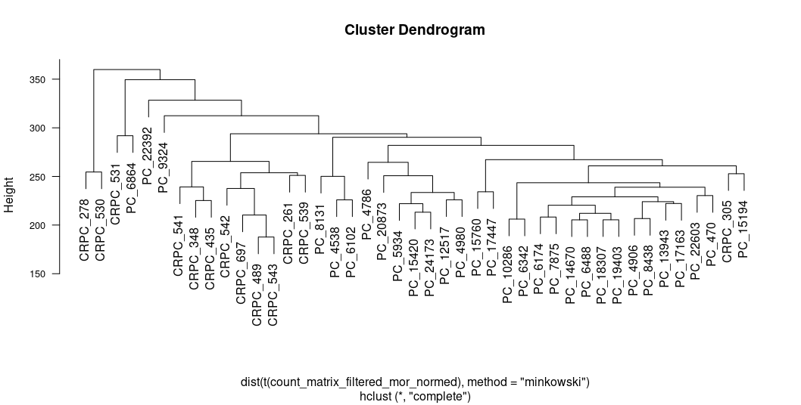

```{r setup, include=FALSE}
knitr::opts_chunk$set(echo = TRUE)
```

# The important difference between CRPC from PC is highly regulated by EDN3

## Abstract

In my project, I want to discover features of castration-resistant prostate cancer and in particular to find the genes which are distinguished from the corresponding genes in untreated prostate cancer. 

## Introduction

Castration-resistant prostate cancer is type of a prostate cancer which continues to progress despite androgen depletion therapy. This type of prostate cancer has a high mortality rate. I make analysis using data with RNA-Seq reads to counts for 21990 genes from 43 samples. There are two groups of samples: castration-resitant prostate cancer  (13 samples) and untreated prostate cancer (30 samples). So we need to make a research about which genes regulate sastration-resistant prostate cancer taking into account expressions of genes from untreated prostate cancer. 

## Results

#### Data preparation

The general view of the data before preparation is shown in on Table 1 (note that not all samples are represented, first 10 genes).

```{r original data, eval = TRUE, echo = FALSE}
library("readxl")
orig_count_matrix <- read_excel("original_count_matrix.xlsx")
knitr::kable(orig_count_matrix, caption = "Original count matrix")
```

After I have done my filtering, normalization and transformation steps, I got the data which is shown on Table 2 (note that not all samples are represented).

```{r data after prep, eval = TRUE, echo = FALSE}
library("readxl")
prep_count_matrix <- read_excel("prep_count_matrix.xlsx")
knitr::kable(prep_count_matrix, caption = "Count matrix after preparation step")
```

Also at the end of the data preparation a made a boxplot which is shown on Figure 1. We can see the similar type of unusual behaviour at CRPC_541, CRPC_543, CRPC_697 relatively to the others.

```{r echo=FALSE, out.width='100%', fig.cap="Boxplot of the prepared data"}
knitr::include_graphics('./boxplot.png')
```

#### Hierarchial clustering

I made a hierarchial clustering using a complete linkage method and a minkowski distance method. So I got the dendogram on Figure 2. We can see some kind of outliers for which I want to pay more attention further: CRPC_530, CRPC_278, PC_6864, PC_9324, PC_22392.

```{r echo=FALSE, out.width='100%', fig.cap="Dendogram with hierarchial clustering"}

```

#### Dimensionality reduction

After dimensionality reduction is done, we can plot 2D graph of first two principal components for each sample. At first, I made graph with colored clusters which is represented on Figure 3 and then for detecting particular samples there is PCA 2D graph with labeled points on Figure 4. From Figure 3 we alreade can see there are outliers for both clusters so let's detect which one by looking at Figure 4. Now we can see that for CRPC (red) cluster there are at least 2 outliers: CRPC_530 and CRPC_278. These CRPC outliers have already detected at previous step (hierarchial clusterin). For PC (green) cluster we can see exact outlier PC_6864 and the ejecta-like -- PC_9324. Again, I can see that they were seen at the last step.

```{r echo=FALSE, out.width='100%', fig.cap="PCA 2D plot with colored clusters"}
knitr::include_graphics('./pca_red_green.png')
```

```{r echo=FALSE, out.width='100%', fig.cap="PCA 2D plot with labeled points"}
knitr::include_graphics('./pca_main.png')
```

#### Differential expression analysis

For differential expression analysis I made ttest, wilcox test and deseq2. After extracting significant genes (5% significance level) for every approach I got a venn diagram on Figure 5. Also, volcano plot with p-value criterion and effect size criterion was made and it's shown on Figure 6. The table of genes whcih satisfies both tests (wilcox and ttest) and its corresponding statistics is shown at supplementary 1.

```{r echo=FALSE, out.width='100%', fig.cap="Venn diagram for ttest, deseq2, wilcox test"}
knitr::include_graphics('./venn.png')
```

```{r echo=FALSE, out.width='100%', fig.cap="Volcano plot"}
knitr::include_graphics('./volcano_plot.png')
```

#### Heat map of differentially expressed genes

The heat map of differentially expressed genes is shown on Figure 7. From the heat map we can see the differentially expressed genes for both 2 clusters. Thus this genes also create clusters and explicitly express regulation of a cancer type (CRPC or PC). In order to better view the graph, I created another one using the library pheatmap which is shown on Figure 8. Since this graph has a more convenient scale, we can again can detect highlighting of result for CRPC_530.

```{r echo=FALSE, out.width='100%', fig.cap="Heat map"}
knitr::include_graphics('./heatmap.png')
```

```{r echo=FALSE, out.width='100%', fig.cap="Pheat map"}
knitr::include_graphics('./pheatmap.png')
```

#### KEGG pathway enrichment analysis

After kegg pathway enrichment analysis I made pathview with it using mean between two groups. So we can use this schemes for further research. One of them (Amoebiasis, 05146) is shown on Figure 9. The table with enriched pathways and its p-values is shown at Supplementary 2.

```{r echo=FALSE, out.width='130%', fig.cap="Pathview Amoebiasis (05146)"}
knitr::include_graphics('./hsa05146_1.png')
```

#### DESeq differential expression analysis (optional)

As extra I made DESeq differential expression analysis at differential expression analysis step. So there is a table with first 10 significant differentially expressed genes on Table 3.

```{r deseq analysis, eval = TRUE, echo = FALSE}
library("readxl")
deseq_matrix <- read_excel("deseq_result.xlsx")
knitr::kable(deseq_matrix, caption = "Significant differentially expressed genes after DESeq")
```

#### Summarize

So intersecting results from all differential expression test (DESeq, ttest, wilcox) I got table of top-10 differentially expressen genes on Table 4.

```{r deseq and tests result, eval = TRUE, echo = FALSE}
library("readxl")
deseq_and_test_result <- read_excel("deseq_and_tests.xlsx")
knitr::kable(deseq_and_test_result, caption = "Significant differentially expressed genes after intersecting results from DESeq, ttest, wilcox")
```

#### Updated summarize

I decided to remove samples-outliers which were detected previously from count matrix with differentially expressed genes and make differentially expression analysis again. The intersecting of the results of ttest, wilcox, DESeq are shown on Table 5.

```{r final deseq and tests result, eval = TRUE, echo = FALSE}
library("readxl")
final_res <- read_excel("final_res.xlsx")
knitr::kable(final_res, caption = "Significant differentially expressed genes without samples-outliers after intersecting results from DESeq, ttest, wilcox")
```

## Discussion

From the analysis done, we can notice the general appearance of clusters of different types of cancer (CRPC and PC). We can also notice that samples-otliers can greatly affect the result. At first, data preparation was performed, with the help of which the matrix began to look so that the values became more comparable (without which it is impossible to conduct an analysis). It is also important to note the filtration stage, which got rid of a certain amount of outliers (genes). Next, clustering (dendogram) was performed, with the help of which we were able for the first time to get acquainted with the division of samples into groups and which ones are more dependent on each other. The next step was to reduce the data dimension to further explore the clusters at graph. Tests were also carried out to check the expression of genes between the two groups. Then a hit map was drawn and a kegg enrichment analysis was made.

It should be noticed the importance of the p-value adjustment and doing several tests (not only one), which very significantly affects the result. Thus there are genes that are present in both summerize and summerise final tables: EDN3, KIAA1210, RPE65 and CCK.

To validate the result, we need counts of more samples of two groups with a large set of genes present (almost like it was). But it is also possible to perform the analysis with a smaller part of the samples for each of the groups and then do the same analysis with another part for each of the groups, and finally compare the results.

As a follow-up study, we can look at the GO annotations in detail, consider in detail the processes from the obtained view of enriched kegg pathways, conduct more statistical tests to identify different expressions of genes between these groups.

## Material and methods

There are 21990 genes for 13 samples of CRPC and 30 samples of PC. At the data preparation step filtering by 25 quantile was made. Then I made log2 transformation of counts. Also, the normalization using DESeq was made. After all these preparations the total number of 16492 genes for both groups remains.

At hierarchical clustering step I decided to use complete linkage method and minkowski distance metric because after comparing results of all linkage methods and distance metrics I found out it the most presentable. For the heat map I chose the same linkage method as for hierarchical clustering but another distance metric -- spearman (since it is best to see the separation of groups).

At the differential expression analysis section I wanted to use as many tests as possible (ttest, wilcox test, DESeq2) to intersect their results. For the enrichment analysis I counted annotations of all genes and of genes considered interesting (differentially expressed) and the numbers of genes of selected annotation were also counted (for both: all and differentially expressed). Then p-values for every kegg pathway were calculated and the most expressed were chosen (at the result I got 4 enriched kegg pathways).

The list of used R packages and its versions: org.Hs.eg.db (3.14.0), DESeq2 (1.34.0), ggplot2 (3.4.0), genefilter (1.76.0), gplots (3.1.3), pheatmap (1.0.12), pathview (1.34.0) (for report: writexl (1.4.1), readxl (1.4.1)).

## R scripts

### Analysis 1

```{r Q-1.1, eval=FALSE}
library(org.Hs.eg.db)
# read matrix
count_matrix = readRDS('RNA_expressions.RDS')

# for report
count_matrix_file = count_matrix[1:10,c(1:3, 17:19)]
count_matrix_file$symbols = mapIds(org.Hs.eg.db, keys = row.names(count_matrix_file), keytype = "ENSEMBL", column = "SYMBOL")
count_matrix_file = count_matrix_file[,c(7, 1:6)]
write_xlsx(count_matrix_file,"original_count_matrix.xlsx")

# removing low expressed genes (including zero expressed genes) (week 2, remove low expressed with median)
row_medians = apply(count_matrix, 1, median)
treshhold_q_25 = quantile(row_medians, 0.25)
count_matrix_filtered = count_matrix[row_medians > treshhold_q_25,]
count_matrix_filtered = round(count_matrix_filtered)
count_matrix_filtered = count_matrix_filtered[order(row.names(count_matrix_filtered)),]

# adding ones and making log2 transformation (week 1, log2 transformation)
count_matrix_filtered_non_zero = count_matrix_filtered + rep(1, dim(count_matrix_filtered)[[1]] * dim(count_matrix_filtered)[[2]])
count_matrix_log2 = log2(count_matrix_filtered_non_zero)
count_matrix_log2 = round(count_matrix_log2)
```

```{r Q-1.2, eval=FALSE}
# normalization
library(DESeq2)

column_names = colnames(count_matrix_log2)

sample_types = matrix(sub(pattern="_.*", 
                          replacement="", 
                          column_names))

rownames(sample_types) = column_names
colnames(sample_types) = c("Type")

## creating the data set expected by DESeq2
dataset <- DESeqDataSetFromMatrix(countData=count_matrix_log2, 
                                  colData=sample_types, 
                                  design=~1)

dataset <- estimateSizeFactors(dataset) 
count_matrix_filtered_mor_normed <- counts(dataset, 
                                           normalized=TRUE)
count_matrix_filtered_mor_normed[1:10, 1:5]

# for report
count_matrix_prep = as.data.frame(count_matrix_filtered_mor_normed[1:10,c(1:3, 17:19)])
count_matrix_prep$symbols = mapIds(org.Hs.eg.db, keys = row.names(count_matrix_prep), keytype = "ENSEMBL", column = "SYMBOL")
count_matrix_prep = count_matrix_prep[,c(7, 1:6)]
write_xlsx(count_matrix_prep,"prep_count_matrix.xlsx")
``` 

```{r Q-1.3, eval=FALSE}
par(las = 2, cex.axis = 0.8)
boxplot(count_matrix_filtered_mor_normed, cex.names = 0.5)

# we can see special behaviour of CRPC_541 and CRPC_543 and CRPC_697 and another group with another type of strange behaviour at crpc_530 and crpc_539
```


```{r Q-1.4, eval=FALSE}
# mapping symbols to ensembl ids
library(org.Hs.eg.db)

count_matrix_filtered_mor_normed_df = as.data.frame(count_matrix_filtered_mor_normed)
count_matrix_filtered_mor_normed_df$symbol = mapIds(org.Hs.eg.db, keys = row.names(count_matrix_filtered_mor_normed_df), keytype = "ENSEMBL", column = "SYMBOL")
count_matrix_filtered_mor_normed_df = count_matrix_filtered_mor_normed_df[, c(44, 1:43)]
count_matrix_filtered_mor_normed_df
```


### Analysis 2

```{r Q-2, eval=FALSE}
plot(hclust(dist(t(count_matrix_filtered_mor_normed), method = "minkowski"), method = "complete"), ann=FALSE)
```

### Analysis 3

```{r Q-3.1, eval=FALSE}
pca_result = prcomp(t(count_matrix_filtered_mor_normed), center = TRUE, scale. = TRUE)
pca_result$rotation[1:5, 1:3]
```


```{r Q-3.2.1, eval=FALSE}
points = t(t(pca_result$rotation[,1:2]) %*% count_matrix_filtered_mor_normed)
plot(points, col = 'green')
points(points[1:13,], col = 'red')
```

```{r Q-3.2.2, eval=FALSE}
pca_result.var = pca_result$sdev^2
pca_result.var.per = round(pca_result.var / sum(pca_result.var) * 100, 1)

library(ggplot2)
pca_result.data = data.frame(Sample=rownames(pca_result$x),
                             X=pca_result$x[,1],
                             Y=pca_result$x[,2])

ggplot(pca_result.data, aes(x=X, y=Y, label=Sample)) +
  geom_text() + 
  xlab(paste('PC1 - ', pca_result.var.per[1], '%', sep='')) +
  ylab(paste('PC2 - ', pca_result.var.per[2], '%', sep='')) +
  theme_bw() + 
  ggtitle('PCA analysis of Prostate cancer gene expression data')

# we can see outliers (with 2 types): PC_6864 (1 type: it's located in another cluster), PC_9324 (2 type: it's located too far from both clusters), CRPC_530 (2 type), CRPC_278 (2 type).
```

#### Analysis 4

```{r Q-4.1, eval=FALSE}
# t-test DE
library(genefilter)
CRPC_PC_factor = factor(sub("_[0-9]*", "", colnames(count_matrix_filtered_mor_normed)))
ttest_results = rowttests(count_matrix_filtered_mor_normed, fac=CRPC_PC_factor)
sum(ttest_results$p.value < 0.05)

ttest_results$p.value.adj = p.adjust(ttest_results$p.value, method='BH')
sum(ttest_results$p.value.adj < 0.05)
# using p adj we got 2 times less number of significant differentially expressed gened with level 5%

ttest_results_ordered = ttest_results[order(ttest_results$p.value.adj),]
ttest_results_ordered$symbol = mapIds(org.Hs.eg.db, keys = row.names(ttest_results_ordered), keytype = "ENSEMBL", column = "SYMBOL")
ttest_results_ordered
```

```{r Q-4.2, eval=FALSE}
#wilcox test
my_wilcox = function(v, group1, group2) {
  
  test_result = wilcox.test(x=v[group1], y=v[group2], exact=FALSE)
  
  p.value = test_result$p.value
  names(p.value) = "p.value"
  
  return(c(test_result$statistic, p.value))
}

wilcox_results = apply(count_matrix_filtered_mor_normed, 1, my_wilcox, group1=1:13, group2=14:43)
wilcox_results_df = as.data.frame(t(wilcox_results))
wilcox_results_df$p.value.adj = p.adjust(wilcox_results_df$p.value, method = 'BH')
sum(wilcox_results_df$p.value < 0.05)
sum(wilcox_results_df$p.value.adj < 0.05)
# after adjustment two times less significant p-values with level 5%
wilcox_results_ordered = wilcox_results_df[order(wilcox_results_df$p.value.adj),]
wilcox_results_ordered$symbol = mapIds(org.Hs.eg.db, keys = row.names(wilcox_results_ordered), keytype = "ENSEMBL", column = "SYMBOL")
wilcox_results_ordered
```

```{r Q-4.3, eval=FALSE}
# it's part of Analysis 7 (optional)

# DESeq differential expression analysis
library(DESeq2)
coldata = data.frame(row.names = colnames(count_matrix_filtered_mor_normed), CRPC_PC_factor)
dds = DESeqDataSetFromMatrix(countData = as.data.frame(round(count_matrix_filtered_mor_normed)), colData = coldata, design = ~CRPC_PC_factor)

dds = DESeq(dds)
vsdata = vst(dds, blind = FALSE)
res_deseq = results(dds, contrast = c('CRPC_PC_factor', 'CRPC', 'PC'))
res_deseq = res_deseq[order(res_deseq$pvalue),]
res_deseq$symbol = mapIds(org.Hs.eg.db, keys = row.names(res_deseq), keytype = "ENSEMBL", column = "SYMBOL")
res_deseq = res_deseq[, c(7, 1:6)]
res_deseq_enriched = res_deseq[res_deseq$padj < 0.05,]
res_deseq_enriched

# for report
res_deseq_file = res_deseq[res_deseq$padj < 0.05,]
res_deseq_file = res_deseq_file[1:10,]
write_xlsx(as.data.frame(res_deseq_file),"deseq_result.xlsx")
```


```{r Q-4.4, eval=FALSE}
# volcano plot + conditions
p_val_below_ttest = ttest_results_ordered$p.value.adj < 0.05
p_val_below_wilcox = wilcox_results_ordered$p.value.adj < 0.05
dm_greater = abs(ttest_results_ordered$dm) > 1
both_pvals = p_val_below_ttest & p_val_below_wilcox
both = both_pvals & dm_greater

plot(ttest_results_ordered[!both, 2], -log10(ttest_results_ordered[!both, 4]), col = "black")
points(ttest_results_ordered[both_pvals, 2], -log10(ttest_results_ordered[both_pvals, 4]), col = "green")
points(ttest_results_ordered[dm_greater, 2], -log10(ttest_results_ordered[dm_greater, 4]), col = "blue")
points(ttest_results_ordered[both, 2], -log10(ttest_results_ordered[both, 4]), col = "red")

gene_satisfied = data.frame(dm = ttest_results_ordered$dm[both], ttest.p.value.adj = ttest_results_ordered$p.value.adj[both], wilcox.test.p.value.adj = wilcox_results_ordered$p.value.adj[both], row.names = rownames(ttest_results_ordered)[both])
gene_satisfied$symbol = mapIds(org.Hs.eg.db, keys = row.names(gene_satisfied), keytype = "ENSEMBL", column = "SYMBOL")
gene_satisfied = gene_satisfied[order(gene_satisfied$ttest.p.value.adj),]
gene_satisfied = gene_satisfied[,c(4, 1:3)]
gene_satisfied

# prepare file for supplement
gene_satisfied_file = gene_satisfied
gene_satisfied_file$ensembl = row.names(gene_satisfied)
gene_satisfied_file = gene_satisfied_file[1:40,c(5, 1:4)]

library(writexl)
write_xlsx(as.data.frame(gene_satisfied_file),"gene_satisfied.xlsx")
```

```{r Q-4.5, eval=FALSE}
# it's also part of Analysis 7 but it should be in DE analysis part
deseq_and_tests_ensembl = intersect(row.names(gene_satisfied), row.names(res_deseq_enriched))
deseq_and_tests = data.frame(symbol = ttest_results_ordered[deseq_and_tests_ensembl,]$symbol, dm = ttest_results_ordered[deseq_and_tests_ensembl,]$dm, ttest_p_adj = ttest_results_ordered[deseq_and_tests_ensembl,]$p.value.adj, wilcox_p_adj = wilcox_results_ordered[deseq_and_tests_ensembl,]$p.value.adj, deseq_p_adj = res_deseq_enriched[deseq_and_tests_ensembl,]$padj, row.names = deseq_and_tests_ensembl)
deseq_and_tests
```

```{r Q-4.6, eval=FALSE}
venn_data = list(ttest = rownames(ttest_results)[ttest_results$p.value.adj < 0.05], wilcox = rownames(wilcox_results_df)[wilcox_results_df$p.value.adj < 0.05], deseq = rownames(res_deseq)[res_deseq$padj < 0.05])
library(gplots)
venn(venn_data)
```

### Analysis 5

```{r Q-5.1, eval=FALSE}
#heatmap

library(pheatmap)
correlation_dist = function(x, method="spearman"){
  
  corr_distance = as.dist((1 - cor(t(x), method=method))/2) ## note the t()
  
  return(corr_distance)
}

cluster_find = function(x, method='complete'){
  
  hcluster = hclust(x, method=method)
  
  return(hcluster)
}

count_matrix_de = count_matrix_filtered_mor_normed[row.names(deseq_and_tests),]

res_heatmap = heatmap(count_matrix_de, distfun = correlation_dist, hclustfun = cluster_find, labRow = FALSE)
res_heatmap
pheatmap(count_matrix_de, show_rownames = F)

#strange result for crpc_530
```


### Analysis 6

```{r Q-6.1, eval=FALSE}
# kegg pathway enrichment
library(org.Hs.eg.db)
map_ke <- as.list(org.Hs.egPATH)

# mapping an ensembl id to entrez id for all genes from the count matrix
all_ensembl2entrez = as.data.frame(mapIds(org.Hs.eg.db, keys = row.names(count_matrix_filtered_mor_normed), keytype = "ENSEMBL", column = "ENTREZID"))
colnames(all_ensembl2entrez) = c("ENTREZID")

# mapping every entrez id from the count matrix to kegg pathway
all_kegg_entrez_pathways = map_ke[!is.na(match(all_ensembl2entrez$ENTREZID, names(map_ke)))]

# return back to ensembl ids but with corresponding pathway
all_ensembl2kegg_pathways = list()
for (i in 1:nrow(all_ensembl2entrez)) {
  temp = all_kegg_entrez_pathways[as.character(all_ensembl2entrez$ENTREZID[i])]
  if (!is.na(names(temp))){
    all_ensembl2kegg_pathways[row.names(all_ensembl2entrez)[i]] = temp
  } 
}

# counting the total number of annotations for all genes from the count matrix
N = sum(!is.na(unlist(all_ensembl2kegg_pathways)))

# the total number of genes (table) for every kegg annotation
ns = table(unlist(all_ensembl2kegg_pathways))

# mapping every ensembl id to entrez id for all genes considered interesting 
# (from previos analysis)
de_ensembl2entrez = as.data.frame(mapIds(org.Hs.eg.db, keys = row.names(deseq_and_tests), keytype = "ENSEMBL", column = "ENTREZID"))
colnames(de_ensembl2entrez) = c("ENTREZID")

# mapping every entrez id from the list of interesting genes to kegg pathway
de_kegg_entrez_pathways = map_ke[!is.na(match(de_ensembl2entrez$ENTREZID, names(map_ke)))]

# return back to ensembl id but with kegg pathways for the list of interesting genes
de_ensembl2kegg_pathways = list()
for (i in 1:nrow(deseq_and_tests)) {
  temp = de_kegg_entrez_pathways[as.character(de_ensembl2entrez$ENTREZID[i])]
  if (!is.na(names(temp))){
    de_ensembl2kegg_pathways[row.names(de_ensembl2entrez)[i]] = temp
  } 
}

# counting the total number of annotations for the interesting genes list
M = sum(!is.na(unlist(de_ensembl2kegg_pathways)))

# counting the total number of interesting genes for every kegg pathway
ks = rep(0, length(ns))
names(ks) = names(ns)
ks[names(table(unlist(de_ensembl2kegg_pathways)))] = table(unlist(de_ensembl2kegg_pathways))

p_vals_kegg_pathways = sort(1 - phyper(ks - 1, M, N - M, ns))
enriched_kegg_pathways = names(p_vals_kegg_pathways)[p_vals_kegg_pathways < 0.05]
enriched_kegg_pathways

# prepare for supplementary
p_vals_kegg_pathways_file = as.data.frame(p_vals_kegg_pathways[p_vals_kegg_pathways < 0.05])
colnames(p_vals_kegg_pathways_file) = c("p-value")
p_vals_kegg_pathways_file$kegg_pathways = row.names(p_vals_kegg_pathways_file)
p_vals_kegg_pathways_file = p_vals_kegg_pathways_file[,c(2,1)]

write_xlsx(p_vals_kegg_pathways_file,"enriched_kegg_pathways.xlsx")
```


### Analysis 7

```{r Q-7.1, eval=FALSE}
library(pathview)
count_matrix_mean_diff = apply(count_matrix_filtered_mor_normed[,14:43], 1, mean) - apply(count_matrix_filtered_mor_normed[,1:13], 1, mean)
pathview_names = c("Amoebiasis", "Protein digestion and absorption", "ECM-receptor interaction", "Focal adhesion")

for (i in seq_along(enriched_kegg_pathways)){
  pathview(gene.data = as.data.frame(count_matrix_mean_diff), out.suffix = pathview_names[i], limit = list(gene=2, cpd=1), pathway.id = enriched_kegg_pathways[i], gene.idtype = "ENSEMBL")
}
```

### Analysis 8

```{r Q-8.1, eval=FALSE}
deseq_and_tests[1:10,]

# for report
deseq_and_tests_file = deseq_and_tests[1:10,]
write_xlsx(deseq_and_tests_file,"deseq_and_tests.xlsx")
```

### Analysis 9

```{r Q-9.1, eval=FALSE}
# removing strange samples
samples_to_remove = c("PC_6864", "PC_9324", "CRPC_530")

remain_count_matrix_filtered_mor_normed = count_matrix_filtered_mor_normed[,(!colnames(count_matrix_filtered_mor_normed) %in% samples_to_remove)]

# new ttest
CRPC_PC_factor_remain = factor(sub("_[0-9]*", "", colnames(remain_count_matrix_filtered_mor_normed)))

remain_ttest_results = rowttests(remain_count_matrix_filtered_mor_normed, fac=CRPC_PC_factor_remain)

remain_ttest_results$p.value.adj = p.adjust(remain_ttest_results$p.value, method='BH')
sum(remain_ttest_results$p.value.adj < 0.05)

remain_ttest_results_ordered = remain_ttest_results[order(remain_ttest_results$p.value.adj),]
remain_ttest_results_ordered$symbol = mapIds(org.Hs.eg.db, keys = row.names(remain_ttest_results_ordered), keytype = "ENSEMBL", column = "SYMBOL")

# new wilcox test
remain_wilcox_results = apply(remain_count_matrix_filtered_mor_normed, 1, my_wilcox, group1=1:11, group2=12:39)
remain_wilcox_results_df = as.data.frame(t(remain_wilcox_results))
remain_wilcox_results_df$p.value.adj = p.adjust(remain_wilcox_results_df$p.value, method = 'BH')
sum(remain_wilcox_results_df$p.value.adj < 0.05)
# after adjustment two times less significant p-values with level 5%
remain_wilcox_results_ordered = remain_wilcox_results_df[order(remain_wilcox_results_df$p.value.adj),]
remain_wilcox_results_ordered$symbol = mapIds(org.Hs.eg.db, keys = row.names(remain_wilcox_results_ordered), keytype = "ENSEMBL", column = "SYMBOL")

# select significant after both tests

p_val_below_remain_ttest = remain_ttest_results_ordered$p.value.adj < 0.05
p_val_below_remain_wilcox = remain_wilcox_results_ordered$p.value.adj < 0.05
dm_greater_remain = abs(remain_ttest_results_ordered$dm) > 1
both_pvals_remain = p_val_below_remain_ttest & p_val_below_remain_wilcox
both_remain = both_pvals_remain & dm_greater_remain

gene_satisfied_remain = data.frame(dm = remain_ttest_results_ordered$dm[both], ttest.p.value.adj = remain_ttest_results_ordered$p.value.adj[both], wilcox.test.p.value.adj = remain_wilcox_results_ordered$p.value.adj[both], row.names = rownames(remain_ttest_results_ordered)[both])

gene_satisfied_remain$symbol = mapIds(org.Hs.eg.db, keys = row.names(gene_satisfied_remain), keytype = "ENSEMBL", column = "SYMBOL")
gene_satisfied_remain = gene_satisfied_remain[order(gene_satisfied_remain$ttest.p.value.adj),]
gene_satisfied_remain = gene_satisfied_remain[,c(4, 1:3)]
gene_satisfied_remain
```

```{r Q-9.2, eval=FALSE}
# new deseq
coldata_remain = data.frame(row.names = colnames(remain_count_matrix_filtered_mor_normed), CRPC_PC_factor_remain)
dds_remain = DESeqDataSetFromMatrix(countData = as.data.frame(round(remain_count_matrix_filtered_mor_normed)), colData = coldata_remain, design = ~CRPC_PC_factor_remain)

dds_remain = DESeq(dds_remain)
vsdata_remain = vst(dds_remain, blind = FALSE)
res_deseq_remain = results(dds_remain, contrast = c('CRPC_PC_factor_remain', 'CRPC', 'PC'))
res_deseq_remain = res_deseq_remain[order(res_deseq_remain$pvalue),]
res_deseq_remain$symbol = mapIds(org.Hs.eg.db, keys = row.names(res_deseq_remain), keytype = "ENSEMBL", column = "SYMBOL")
res_deseq_remain = res_deseq_remain[, c(7, 1:6)]
res_deseq_enriched_remain = res_deseq_remain[res_deseq_remain$padj < 0.05,]
res_deseq_enriched_remain
```

```{r Q-9.3, eval=FALSE}
# compare new tests and deseq
deseq_and_tests_ensembl_remain = intersect(row.names(gene_satisfied_remain), row.names(res_deseq_enriched_remain))
deseq_and_tests_remain = data.frame(symbol = remain_ttest_results_ordered[deseq_and_tests_ensembl_remain,]$symbol, dm = remain_ttest_results_ordered[deseq_and_tests_ensembl_remain,]$dm, ttest_p_adj = remain_ttest_results_ordered[deseq_and_tests_ensembl_remain,]$p.value.adj, wilcox_p_adj = remain_wilcox_results_ordered[deseq_and_tests_ensembl_remain,]$p.value.adj, deseq_p_adj = res_deseq_enriched_remain[deseq_and_tests_ensembl_remain,]$padj, row.names = deseq_and_tests_ensembl_remain)
deseq_and_tests
deseq_and_tests_remain

final_res = deseq_and_tests_remain[row.names(deseq_and_tests_remain)[1:10] %in% row.names(deseq_and_tests)[1:10],]
final_res

# for report 
write_xlsx(final_res,"final_res.xlsx")
```
### Supplement

#### Supplemet 1 (table gene_satisfied)

```{r supplementary 1, eval = TRUE, echo = FALSE}
library("readxl")
suppl_table_1 <- read_excel("gene_satisfied.xlsx")
knitr::kable(suppl_table_1, caption = "List of genes with test statistics which satisfied both conditions")
```

#### Supplement 2 (table with enriched kegg pathways)

```{r supplemetary 2, eval = TRUE, echo = FALSE}
suppl_table_2 <- read_excel("enriched_kegg_pathways.xlsx")
knitr::kable(suppl_table_2, caption = "Enriched kegg pathways")
```
